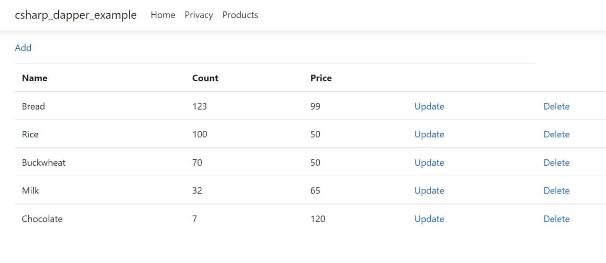
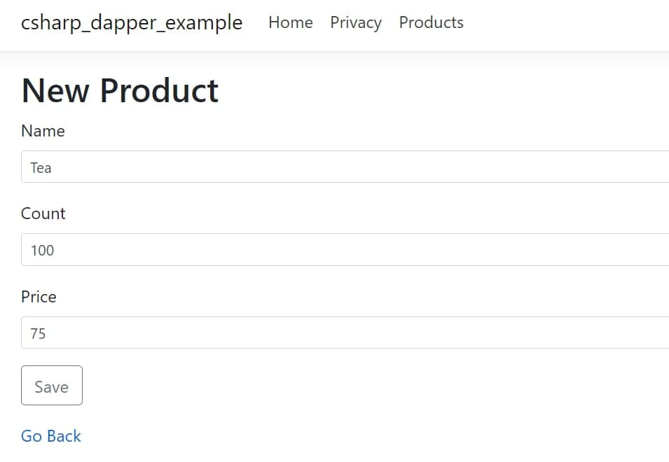

# 
 Csharp Dapper Example 

### :triangular_flag_on_post: *Introduction*
I present to your attention my small backend project!
It was created in order to improve my skills in backend development,
work with important technologies and continue my way as a C# developer

____________________________________________

### :floppy_disk: *Technologies*
During the development of such a pet-project, I had time to work with some technology:
+ C#
+ Asp.net core
+ PostgreSQL
+ Dapper micro-orm
+ Moq framework
+ Docker

____________________________________________

### :pencil2: *Description*
The project involves the client interacting with the server by sending and processing http requests. This application implements basic data manipulation operations by the user:
+ Product creation
+ Getting data about existing products and their features
+ Changing product features
+ Removing a product
  
  

____________________________________________

### :checkered_flag: *P.S.*
Thank you for reviewing this simple project!
